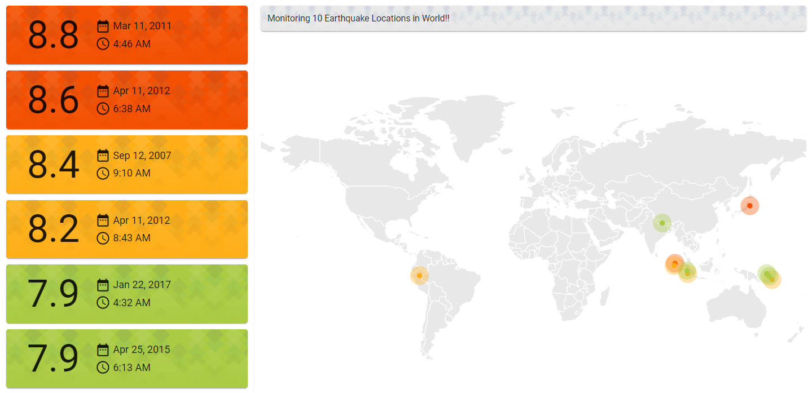

#   Earthquake App

It is real time Earthquakes Application (Responsive) using [GeoNames](https://www.geonames.org/) API's.

> An earthquake is the sudden movement of the Earth's tectonic plates, resulting in shaking of the ground.

[Let's View Live !!](https://kprokkie.github.io/earthquake-app/)

## What you see here in App



Application will display all the earthquakes information in list & its corresponding location in map.

Actioning (click) on card will show more equarthquake information & will zoom the map for that earthquake location.

> Cards color & Spot Circles color are based on the `magnitude` of earthquake.

```ts
export const MAGNITUDE = {
    RANGE: {
        HIGH: 8.5,
        MEDIUM: 8,
        LOW: 4
    }
}
```

## App Folder Structure

- Views: `[EarthquakesComponent, ErrorComponent]`
- Components: `[BannerComponent, CardComponent, MapComponent, HeaderComponent, FooterComponent]`
- Interfaces: `[Earthquake, Map]`
- Resolvers: `[EarthquakesResolver]`
- Services: `[HttpService]`
- NgRx: `[Actions, Reducers, Selectors, Effects]`

## About Project

This project was generated with [Angular CLI](https://github.com/angular/angular-cli) using Angular 9 & NgRx 9.

## How to run project locally

* Clone the code repository `git clone https://github.com/kprokkie/earthquake-app.git`
* Run `npm install` to dowload the project dependencies.
* Run `ng serve` for a dev server.
* Navigate to `http://localhost:4200/`

The app will automatically reload if you change any of the source files.

## How to build project for deployement

* Run `ng build` to build the project. 

The build artifacts will be stored in the `dist/` directory. Use the `--prod` flag for a production build.

## How to deploy project to github pages

* git checkout -b gh-pages
* git push origin gh-pages
* npm install -g angular-cli-ghpages
* ng build --prod --base-href https://[username].github.io/[repo]/
* ngh --dir=dist/[project-name]

## Running unit tests

* Run `ng test` to execute the unit tests via [Karma](https://karma-runner.github.io).
